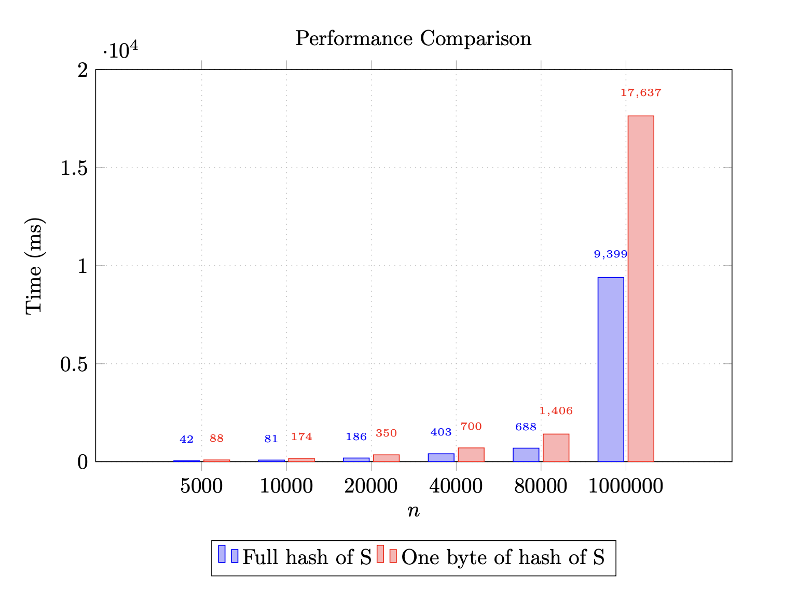

# Module Learning with Errors Stealth Address Protocol.

  

### Introduction

  

Stealth Address Protocol(SAP) is a way to provide user stealth address that they can receive assets on, that can't be linked to them.

  

We propose SAP that utilizes lattice-based cryptography to protect user from quantum adversary.

  

### (M)LWE

Let $k$ be a positive integer parameter. Let $\textbf{s}$ and $e_i$ be "small". What do we mean by small? We define a set $B_\eta = \{f \in R_q, \lVert f \rVert _\infty \leq \eta \}$, a set of polynomials in $R_q$ whose coefficients have size at most of $\eta$. Infinity norm for element $f \in \mathbb{Z}_q$ is defined as $\lVert f \rVert _\infty = \lvert f \bmod{q}^+ \rvert$.

  

For element in $f \in R_q$ we define it as the maximum of norms of all coefficients of a polynomial in $R_q$. Since each coefficient is in $\mathbb{Z}_q$, we know how to calculate it(norm above). Formally $\lVert f \rVert _\infty = \max \lVert f_i \rVert _\infty$.

  

Same analogy applies to an element $f \in R_q^k$.

  

So we sample $\textbf{s} \gets B_\eta^k$ and $e_i \gets B_\eta$. We sample $a_i$ uniformly from $R_q^k$, $\textbf{a}_i \gets R_q^k$ .

  

**Search MLWE** is a problem to find $\textbf{s}$ given pair $(\textbf{a}_i , b_i) \in R_q^k \times R_q$, where $b_i = \textbf{a}_i^T \textbf{s}+ e_i$ that represents MLWE sample.

  

**Decision MLWE** is a problem to distinguish our MLWE sample $(\textbf{a}_i , b_i) \in R_q^k \times R_q$, where $b_i = \textbf{a}_i^T \textbf{s}+ e_i$ from uniformly random sample $(\textbf{a}_i , b_i) \in R_q^k \times R_q$.

  

MLWE is a generalisation of RLWE and LWE problems.

  

### Post-Quantum SAP

The protocol works as follows:

  

Sender takes $M$ from ENS registry, runs encapsulation by calling Kyber.CCA.Encaps with public-key $V$ and derives shared secret $S$ and ciphertext $R$ which will serve as his public ephemeral key $R$.

  

Sender sends $R$ and a view tag(one byte of hex of shared secret) to the Ephemeral Public Key Registry.

  

Recipient then searches the Ephemeral Public Key Registry and for each retrieved value $R_i$ calculates shared secret by running Kyber.CCA.Decaps with his secret key $v$ and $R_i$ and compares $S$ with the view tag until it matches. When there is a match, it calculates the address and checks if it's the address to which the sender sent the money. Recipient calculates public key $P$ of stealth address:

$$P = A(k+\text{XOF}(S)) + e_1$$

**XOF** is an **eXtendable Output Function**, it is a function that operates on bit strings in which the output can be extended to any desired length. This function is deterministic.

  

$P$ can only be calculated by sender and the one who owns the viewing key (recipient and e.g. a tax inspector), because it is necessary to have either the private ephemeral key r (which has only the sender) or the viewing key $v$ to calculate $S$.

  

The private key of the stealth address is

$$k + \text{XOF}(S)$$

and can only be calculated by the recipient, because it is necessary to have private key $k$, which only the recipient has.

  

For more detailed explanation of Kyber refer to our paper, Kyber-KEM original paper or Prof. Menezes lectures.

  

Our protocol works in MLWE and RLWE and LWE setting. Where Kyber, Newhope and FrodoKEM are underlying key encapsulation mechanisms respecitvely.

  

  

### PQSAP Implementation details
Two important functions to consider are:

- `Scan`, done by recipient, scans the ephemeral public key registry to find potential stealth public keys.

- `Send`, done by sender, given stealth meta-address for recipient calculates and returns ephemeral public key, stealth public key(address to send to), view tag.

  

`src/crypto/kem.rs` contains `encaps`, `decaps` and `key_pair` functions that call Kyber or Newhope based on features.

  

We provide test for correctness of our protocol, checks whether sender and recipient calculated the same stealth address in `tests/protocol_tests.rs` and key-encapsulation mechanism tests that test it's correctness in `tests/kem_tests.rs`.

  

You can run tests with the following command:

`cargo test protocol_tests`

or

`cargo test kem_tests`

  

First benchmark code can be found at `benchmarks/benchmark1.rs`. Benchmarks are ran with $N \in \{5000, 10000, 20000, 40000, 80000\}$, where $N$ is number of announcements in the ephemeral public key registry for fixed spending, viewing key and view tag size.

Second benchmark is at `benchmarks/pq_sap_whole_hash_shuffling_benchmark.rs`. It runs with $N \in \{5000, 10000, 20000, 40000, 80000\}$ but now we set viewtag to be the whole hash of $S$ instead of one byte, it first creates a registry and then shuffles it since we stop out for loop now once we hit the hash of S.

Third benchmark is at `benchmarks/viewtags_comparison_benchmark.rs`. It runs with $N \in \{5000, 10000, 20000, 40000, 80000\}$, but now we compare the results using the whole hash as a viewtag, one byte of hash and no viewtag at all.

Fourth benchmark is benchmarking the HybridSAP in the same way as the first benchmark did.

You can run benchmarks with the following command:

`cargo run --release --bin benchmark_name`

If you want, you can change the underlying kyber parameters by adding features, for example:

`cargo run --release --bin benchmark_name --features kyber512`

With default one being `Kyber768`.  

Available:

1) `kyber512`

2) `kyber768`

3) `kyber1024`

4) `newhope512`

5) `newhope1024`

6) `frodo640`

7) `frodo976`

8) `frodo1344`

### HybridSAP 
HybridSAP utilizes Post-Quantum mechanisms in order to speed up a part of protocol that scans for stealth addresses. Since we still use elliptic-curve keys this version of the protocol is not quantum safe. 

Here $(K, V)$ keypair would contain `secp256k1` public-key $K$ and `Kyber` public-key $V$. 

The main difference is that stealth public-key is calculated as $P = s \cdot G + K$ where $s$ is the output of KyberKEM, of course in order for this to work $s$ has to be taken $\bmod p$ where $p$ is modulo of `secp256k1` curve. Everything else stays the same 

In order to access the funds, one would have to compute stealth private-key $p$ as $p = s+k$ since $P = (s + k) \cdot G$, where $k$ is `secp256k1` private-key. 

This allows us to have on-chain version of our protocol. 

### HybridSAP Implementation  details 

Protocol can be accessed in two ways: 
1) CLI 
2) Rest API 

The CLI is pretty straight-forward to use, in order to send eth, user would need to input the amount to be sent, his wallet's private-key and ens name of the recipient.  In order to receive the funds from the stealth address one would have to input his $k$, $v$ and destination wallet.  

Rest API exposes two endpoints, `send_eth` and `receive_eth`. `send_eth` uses meta-address to compute the stealth public key, stealth address, ephemeral public key and viewtag for user, afterwards the user needs to use client side code(our cli for example) in order to sign and finish the transaction. `scan-eth` needs $v$ but it is good because we can outsource this search to the server, after receiving potential addresses to claim money and shared secret the user can use it's $k$ to compute the stealth private key and receive the funds(again we stress that this needs to be done on client side, for example, cli).  

MySQL is used in order to store metadata, that is the destination wallet and the last block accessed pair, in order to avoid redundant search of announcements, it searches from the last block accessed to the latest block.  

In order to execute the smart contract and send transactions, `ethers-rs` is utilized. `PQSAP_Announcer.sol` is the contract that announces the stealth address, ephemeral public key and viewtag and transfers money to the calculated stealth address. 

The address of the mainnet contract is `0xED737936e54fAC3B4fF271928a7E31Bc140119B0` and address of the testnet contract is `0xA0670138449C6E0e9EB2116949a783A9b0D5A22A`. These are set in `.env` as well as the connection and database string. The last thing to be set in the `.env`  is the provider string(Alchemy, Infura...), this is necessary in order to be able to do any interaction with the blockchain.

### Results

All benchmarks are ran on Macbook M2

Hybrid SAP: 
As we can see in the results below, indeed we managed to keep the speed of KyberKEM. 
| Time (ms) | n |

| --------- | ----- |

| 87 | 5000 |

| 177 | 10000 |

| 355 | 20000 |

| 711 | 40000 |

| 1426 | 80000 |

Kyber512:

  

| Time (ms) | n |

| --------- | ----- |

| 88 | 5000 |

| 174 | 10000 |

| 350 | 20000 |

| 700 | 40000 |

| 1406 | 80000 |

  

Newhope512:

  

| Time (ms) | n |

| --------- | ----- |

| 148 | 5000 |

| 301 | 10000 |

| 597 | 20000 |

| 1198 | 40000 |

| 2395 | 80000 |

  

Frodo640:

  

|Time(**s**)| n |

| --------- | ----- |

| 6.4 | 5000 |

| 12.9 | 10000 |

| 25.9 | 20000 |

| 51.5 | 40000 |

| 103.9 | 80000 |

  

Next section is for n = 5000

  

| Time (ms) | Paramset |

| --------- | --------- |

| 88 | Kyber512 |

| 141 | Kyber768 |

| 205 | Kyber1024 |

| 148 | Newhope512|

| 293 |Newhope1024|

| 6444 | Frodo640 |

| 13975 | Frodo976 |

| 24806 | Frodo1344 |

  

Result of running benchmark2 and benchmark1 with Kyber512.

  
### Resources

- https://cryptography101.ca/kyber-dilithium/

- https://eprint.iacr.org/2017/634.pdf

- https://eprint.iacr.org/2015/1092.pdf

- https://frodokem.org/files/FrodoKEM-specification-20210604.pdf