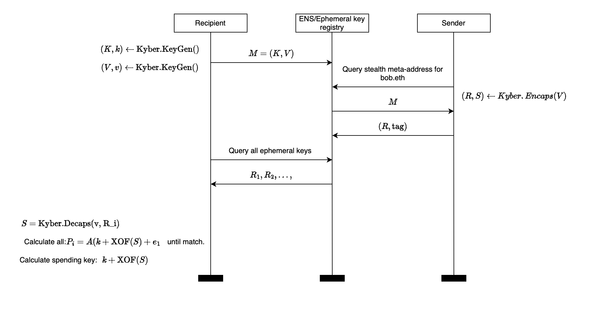

# Module Learning with Errors Stealth Address Protocol.

### Introduction

Stealth Address Protocol(SAP) is a way to provide user stealth address that they can receive assets on, that can't be linked to them.

We propose SAP that utilizes Module Learning with Errors(MLWE) to protect user from quantum adversary. It uses NIST finalist Kyber-KEM at it's core. 

### (M)LWE 
Let $k$ be a positive integer parameter. Let $\textbf{s}$ and $e_i$  be "small". What do we mean by small? We define a set $B_\eta = \{f \in R_q, \lVert f \rVert _\infty \leq \eta \}$, a set of polynomials in $R_q$ whose coefficients have size at most of  $\eta$. Infinity norm for element $f \in \mathbb{Z}_q$  is defined as $\lVert f \rVert _\infty = \lvert f \bmod{q}^+ \rvert$.   

For element in $f \in R_q$ we define it as the maximum of norms of all coefficients of a polynomial in $R_q$. Since each coefficient is in $\mathbb{Z}_q$, we know how to calculate it(norm above). Formally $\lVert f \rVert _\infty = \max \lVert f_i \rVert _\infty$.   

Same analogy applies to an element $f \in R_q^k$. 

So we sample $\textbf{s} \gets B_\eta^k$ and $e_i \gets B_\eta$. We sample $a_i$ uniformly from $R_q^k$, $\textbf{a}_i \gets R_q^k$ . 

**Search MLWE** is a problem to find $\textbf{s}$ given pair $(\textbf{a}_i , b_i) \in R_q^k \times R_q$, where $b_i = \textbf{a}_i^T \textbf{s}+ e_i$ that represents MLWE sample. 

**Decision MLWE** is a problem to distinguish our MLWE sample $(\textbf{a}_i , b_i) \in R_q^k \times R_q$, where $b_i = \textbf{a}_i^T \textbf{s}+ e_i$ from uniformly random sample $(\textbf{a}_i , b_i) \in R_q^k \times R_q$.

MLWE is a generalisation of RLWE and LWE problems. 

### Post-Quantum SAP 
The protocol works as follows: 

Sender takes $M$ from ENS registry, runs encapsulation by calling Kyber.CCA.Encaps with public-key $V$ and derives shared secret $S$ and ciphertext $R$ which will serve as his public ephemeral key $R$. 

Sender sends $R$ and a view tag(one byte of hex of shared secret) to the Ephemeral Public Key Registry. 

Recipient then searches the Ephemeral Public Key Registry and for each retrieved value $R_i$ calculates shared secret by running Kyber.CCA.Decaps with his secret key $v$ and $R_i$ and compares $S$ with the view tag until it matches. When there is a match, it calculates the address and checks if it's the address to which the sender sent the money. Recipient calculates public key $P$ of stealth address: 
$$P = A(k+\text{XOF}(S)) + e_1$$
**XOF** is an **eXtendable Output Function**, it is a function that operates on bit strings in which the output can be extended to any desired length. This function is deterministic. 

$P$ can only be calculated by sender and the one who owns the viewing key (recipient and e.g. a tax inspector), because it is necessary to have either the private ephemeral key r (which has only the sender) or the viewing key $v$ to calculate $S$.

The private key of the stealth address is 
$$k + \text{XOF}(S)$$
and can only be calculated by the recipient, because it is necessary to have private key $k$, which only the recipient has. 

For more detailed explanation of Kyber refer to our paper, Kyber-KEM original paper or Prof. Menezes lectures. 

Our protocol works in both MLWE and RLWE settings. Where Kyber and Newhope are underlying key encapsulation mechanisms respecitvely.

### Implementation details
Two important functions to consider are: 
- `Scan`, done by recipient, scans the ephemeral public key registry to find potential stealth public keys. 
- `Send`, done by sender, given stealth meta-address for recipient calculates and returns ephemeral public key, stealth public key(address to send to), view tag.

`src/crypto/kem.rs` contains `encaps`, `decaps` and `key_pair` functions that call Kyber or Newhope based on features. 

We provide test for correctness of our protocol, checks whether sender and recipient calculated the same stealth address in `tests/protocol_tests.rs` and key-encapsulation mechanism tests that test it's correctness in `tests/kem_tests.rs`. 

You can run tests with the following command:
`cargo test protocol_tests`
or 
`cargo test kem_tests`

Benchmark code can be found at `benchmarks/benchmark1.rs`.  Benchmarks are ran with $N \in \{5000, 10000, 20000, 40000, 80000\}$, where $N$ is number of announcements in the ephemeral public key registry for fixed spending, viewing key and view tag size.

You can run benchmarks with the following command: 
`cargo run --release --bin benchmark1`

If you want, you can change the underlying kyber parameters by adding features, for example: 
`cargo run --release --bin benchmark1 --features kyber512`

With default one being `Kyber768`.

Available: 
1) `kyber512`
2) `kyber768`
3) `kyber1024`
4) `newhope512`
5) `newhope1024` 

### Results 
Ran on Macbook M2 with Kyber512.

| Time (ms) | n     |
| --------- | ----- |
| 86        | 5000  |
| 175       | 10000 |
| 349       | 20000 |
| 704       | 40000 |
| 1406      | 80000 |

Newhope512: 

| Time (ms) | n     |
| --------- | ----- |
| 150       | 5000  |
| 307       | 10000 |
| 610       | 20000 |
| 1214      | 40000 |
| 2453      | 80000 |

Next sections is for n = 5000 

| Time (ms) | Paramset  |
| --------- | --------- |
| 86        | Kyber512  |
| 140       | Kyber768  |
| 205       | Kyber1024 |
| 148       | Newhope512|
| 300       |Newhope1024|

### Resources 
- https://cryptography101.ca/kyber-dilithium/
- https://eprint.iacr.org/2017/634.pdf